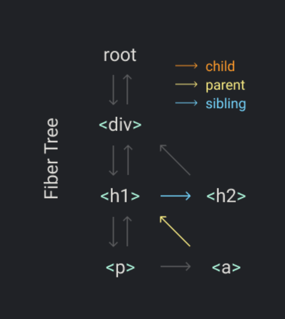

# react 最简单实现

## 参考地址

[地址](https://pomb.us/build-your-own-react/)

## react 解决什么问题？

    理解了为什么会出现这个东西，才能更好理解他的原理；
    react出现之前，我们是怎么写代码的？
        1.我们直接操作dom节点；
        2.我们直接操作dom节点的时候，我们需要考虑的问题：
            1.我们需要考虑dom节点的增删改查；
            2.我们需要考虑dom节点的性能问题；
            3.我们需要考虑dom节点的复用问题；
            4.我们需要考虑dom节点的更新问题；
            5.我们需要考虑dom节点的事件处理问题；
            等等问题。。。。
        3.我们需要考虑的问题太多了，所以react出现了；
    react解决的问题：
        1.我们不再直接操作dom节点，而是操作虚拟dom节点；
        2.我们只需要考虑虚拟dom节点的增删改查；
        3.虚拟dom节点的更新，react会帮我们处理；
        4.虚拟dom节点的复用，react会帮我们处理；
        5.虚拟dom节点的事件处理，react会帮我们处理；
        等等衍生出来的问题，react都会帮我们处理；

## react 最简单的写法

```jsx
const element = <h1 title="foo">Hello</h1>;
const container = document.getElementById("root");
ReactDOM.render(element, container);
```

    他的功能是：
        1. 第一行我们写了一个jsx语法表示的dom节点；
           1. jsx就是一种语法糖，用来简化描述dom节点；最终会被编译成js对象；
        2. 第二行我们获取了一个dom节点；作为容器；
        3. 第三行我们把jsx语法渲染到dom节点中；

## 根据这个最简单的写法，实现他们的功能

    1.将jsx解析成js对象;这个需要用到开发工具的babel插件；
        1.jsx会被编译成React.createElement()函数；
    2.实现createElement函数，将js对象转换成虚拟dom节点；
    3.编写render函数
        1.将虚拟dom节点转换成真实dom节点；
        2.将真实dom节点挂载到容器中；
    3.1.实现createElement函数

```jsx
function createElement(type, props, ...children) {
  return {
    type,
    props: {
      ...props,
      children: children.map((child) =>
        typeof child === "object" ? child : createTextElement(child)
      ),
    },
  };
}
function createTextElement(text) {
  return {
    type: "TEXT_ELEMENT",
    props: {
      nodeValue: text,
      children: [],
    },
  };
}
```

    以上内容基本实现了一个将jsx转化成dom对象的功能；

    4.在以上的render中已经可以挂载了，但是如果花费的时间太长，会影响一些动画或者让用户操作卡主；所以我们需要把render改成并发模式；

```js
let nextUnitOfWork = null;
function workLoop(deadline) {
  let shouldYield = false;
  while (nextUnitOfWork && !shouldYield) {
    nextUnitOfWork = performUnitOfWork(nextUnitOfWork);
    shouldYield = deadline.timeRemaining() < 1;
  }
  requestIdleCallback(workLoop);
}
requestIdleCallback(workLoop);
function performUnitOfWork(nextUnitOfWork) {
  // TODO
}
```

    这个代码使用了requestIdleCallback，这个api会在浏览器空闲的时候执行我们的代码；在react最新版本中，使用了scheduler来实现这个功能；
    5.fiber



    fiber是一种数据结构，用来描述组件树的一种更轻量的对象；同时可以让我们更好的控制组件的渲染过程；

    对于fiber架构的数据，我们使用深度优先遍历的方式，来实现他的渲染；
        类似于上图中的执行顺序；

    6.在以上流程中虽然实现了中断更新，但是dom操作可能只执行了一半就停止了，这样会导致dom节点的不一致；所以我们需要在fiber架构中，实现一个commit阶段，来保证dom节点的一致性；
        就是将操作dom节点的代码，放到commit阶段中；

```js
function reconcileChildren(wipFiber, elements) {
  let index = 0;
  let oldFiber = wipFiber.alternate && wipFiber.alternate.child; // 旧fiber的子节点
  let prevSibling = null;

  while (index < elements.length || oldFiber != null) {
    const element = elements[index];
    let newFiber = null;

    // 判断是否需要更新节点
    const sameType = oldFiber && element && element.type == oldFiber.type;

    if (sameType) {
      // 更新节点
      newFiber = {
        type: oldFiber.type,
        props: element.props,
        dom: oldFiber.dom,
        parent: wipFiber,
        alternate: oldFiber,
        effectTag: "UPDATE",
      };
    }
    if (element && !sameType) {
      // 添加节点
      newFiber = {
        type: element.type,
        props: element.props,
        dom: null,
        parent: wipFiber,
        alternate: null,
        effectTag: "PLACEMENT",
      };
    }
    if (oldFiber && !sameType) {
      // 删除节点
      oldFiber.effectTag = "DELETION";
      deletions.push(oldFiber);
    }

    if (oldFiber) {
      oldFiber = oldFiber.sibling;
    }

    if (index === 0) {
      wipFiber.child = newFiber;
    } else if (element) {
      prevSibling.sibling = newFiber;
    }

    prevSibling = newFiber;
    index++;
  }
}
```

    在reconcileChildren中，我们标记了三种操作：更新，添加，删除；在commitRoot阶段统一更新节点；

```js
function commitRoot() {
  deletions.forEach(commitWork);
  commitWork(wipRoot.child);
  currentRoot = wipRoot;
  wipRoot = null;
}
```

    7.在以上我们只实现了新增dom节点，但是没有实现更新和删除；所以我们需要在fiber架构中，实现更新和删除的功能；

        在reconcileChildren中，我们标记了三种操作：更新，添加，删除；为了简略，已经在上面写了；

    8.针对FunctionComponent和ClassComponent，我们需要在fiber架构中，实现他们的功能；
        FunctionComponent和普通HostComponent的区别：
            需要执行function()返回对应dom节点；

```js
function updateFunctionComponent(fiber) {
  wipFiber = fiber;
  hookIndex = 0;
  wipFiber.hooks = [];
  const children = [fiber.type(fiber.props)];
  reconcileChildren(fiber, children);
}
```

    9.实现useState的功能
        1.useState是react提供的一个hook函数，用来实现组件的状态管理；
        2.setState调用后，会触发组件的重新渲染；

```js
function useState(initial) {
  const oldHook =
    wipFiber.alternate &&
    wipFiber.alternate.hooks &&
    wipFiber.alternate.hooks[hookIndex];
  const hook = {
    state: oldHook ? oldHook.state : initial,
    queue: [],
  };

  const actions = oldHook ? oldHook.queue : [];
  actions.forEach((action) => {
    hook.state = action(hook.state);
  });

  const setState = (action) => {
    hook.queue.push(action);
    wipRoot = {
      dom: currentRoot.dom,
      props: currentRoot.props,
      alternate: currentRoot,
    };
    nextUnitOfWork = wipRoot;
    deletions = [];
  };

  wipFiber.hooks.push(hook);
  hookIndex++;
  return [hook.state, setState];
}
```

实现参考沙盒地址：
<https://codesandbox.io/s/didact-6-96533?file=/src/index.js>

## 测试方案

    1.点击vscode右下角插件：Go Live
    2.插件会打开网址，然后就可以开始调试了；
    3.调试完成后，点击vscode右下角插件：Go Live，关闭网页；

### 其他的点

    1.在createElement中，对children进行转化，如果是对象就直接返回，如果是字符串就转化成TEXT_ELEMENT；
    2.在render中，最简单的实现是直接操作dom节点，这块涉及到很多dom操作的细节；
    3.在实际的react中，还有很多的功能，比如：事件处理，生命周期，hooks等等；还有useEffect，useReducer等等；

## Processon 地址

[react 简易版原理](https://www.processon.com/diagraming/663dcde260678e4383288d71)
