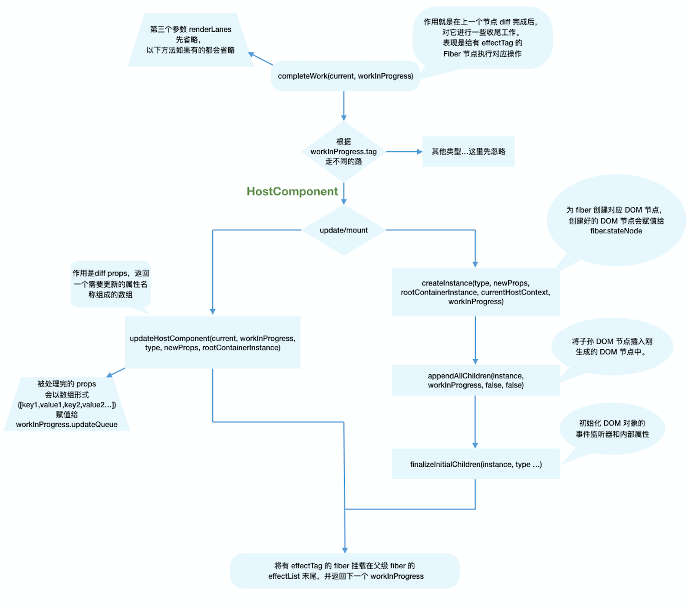

# 了解原理

## 做事都要有目的

    这个学习的主要目的是了解原理，不需要熟悉源码，只需要了解原理即可。

    参考文档：https://react.iamkasong.com/

## 还是从最基本的开始

```jsx
const element = <h1 title="foo">Hello</h1>;
const container = document.getElementById("root");
ReactDOM.render(element, container);
```

    在这个最基本的react代码中：
        1. 第一行我们写了一个jsx语法表示的dom节点；
           1. jsx就是一种语法糖，用来简化描述dom节点；最终会被编译成js对象；
        2. 第二行我们获取了一个dom节点；作为容器；
        3. 第三行我们把jsx语法渲染到dom节点中；

## 我们已经学过了第一章，实现一个最简单的 react 代码，所以对 react 流程有了一个基本的概念，那么我们结合基础知识然后对代码进行稍微深入的了解

### jsx 语法的处理

    1.jsx是将dom节点转换成js对象的语法糖，后续会被编译成React.createElement()函数；
    2.createElement函数将js对象转换成虚拟dom节点；这个具体代码不展开了；因为面试不可能问这块；
    3.只要知道这个函数的返回值是一个js对象；也叫做react元素；

### render 函数的实现

    1.我们需要了解fiber架构；因为这是整个react的核心；
    2.fiber架构是一个链表结构，每个节点都是一个fiber对象；
        1.使用requestIdleCallback函数，将任务分成多个小任务；在空闲的时候执行；
        2.fiber架构可以让中断和恢复组件的渲染不会丢失数据；
    3.以上是fiber架构的基本概念；
    4.下面会深入介绍fiber架构的执行逻辑；

### 我们先从 fiber 架构的执行入手，了解项目执行逻辑

```jsx
// performSyncWorkOnRoot会调用该方法
function workLoopSync() {
  while (workInProgress !== null) {
    performUnitOfWork(workInProgress);
  }
}

// performConcurrentWorkOnRoot会调用该方法
function workLoopConcurrent() {
  while (workInProgress !== null && !shouldYield()) {
    performUnitOfWork(workInProgress);
  }
}
```

    以上先是中断和恢复的执行逻辑，workLoopConcurrent是支持异步的；在最新的react版本中，使用的是他们自己实现的调度器；
    在后面有个专门的模块会讲他的实现；

```jsx
function App() {
  return (
    <div>
      i am
      <span>KaSong</span>
    </div>
  );
}

ReactDOM.render(<App />, document.getElementById("root"));
```


以上是 fiber 架构的执行逻辑图；

  从数据结构层面上
    1.如上图所示：他是一种链表结构，执行的话采用深度优先遍历算法获取数据；（有个语法叫深度优先搜索并完成），还有个递归性
      他的链表性体现在：每个节点都有一个child，sibling，return属性；这样就形成了一个链表结构；
      他的深度优先遍历体现在：他会先遍历子节点，然后再遍历兄弟节点；
      他的递归性体现在：他会先遍历子节点，然后再遍历兄弟节点；最终回到父节点；
  从内容层面上：
    1.每个fiber节点都节点信息，存储当前虚拟dom信息等；引用了他的dom节点；
  从执行层面上：
    每个fiber节点都是执行单元；支持中断和恢复；

  fiber执行执行流程：
    深度优先遍历&递归性
    <!-- 1.在遍历过程中，先执行当前节点的beginWork方法；
    2.如果有子节点，执行子节点的beginWork方法；
    3.当没有子节点的时候执行自己的completeWork方法；
    4.当自己的completeWork方法执行完毕，看有没有兄弟节点，有的话执行兄弟节点的beginWork方法；
    5.如果兄弟节点执行完毕，回到父节点，执行父节点的completeWork方法；
    6.重复以上步骤，直到遍历完所有节点； -->
    树的深度优先算法；
    往下遍历的时候，执行beginWork方法；主要是传入当前fiber节点，生成或者更新子fiber节点；建立fiber关联关系；
    往上遍历的时候，执行completeWork方法；主要是生成dom节点；建立dom关联关系；将effectTag的fiber节点，收集到effect链表中；

#### fiber双缓存机制

    1.在react中，有两个fiber树，一个current树，一个workInProgress树；
    2.在更新的时候，会在workInProgress树上进行更新；
    3.更新完毕后，会将workInProgress树赋值给current树；
    4.这样就实现了双缓存机制；

#### beginWork做了什么


#### endWork做了什么



### commit阶段

  在这个阶段会将fiberRootNode作为参数传入commitRoot方法；

#### before mutation阶段

    1.在commit阶段，会执行commitBeforeMutationEffects方法；
    2.在这个方法中，会执行所有节点的getSnapshotBeforeUpdate方法; 

#### mutation阶段
  
      1.在commit阶段，会执行commitMutationEffects方法；
      2.在这个方法中，会执行所有节点的update方法；

#### layout阶段

      1.在commit阶段，会执行commitLayoutEffects方法；
      2.在这个方法中，会执行所有节点的layoutEffects方法；
