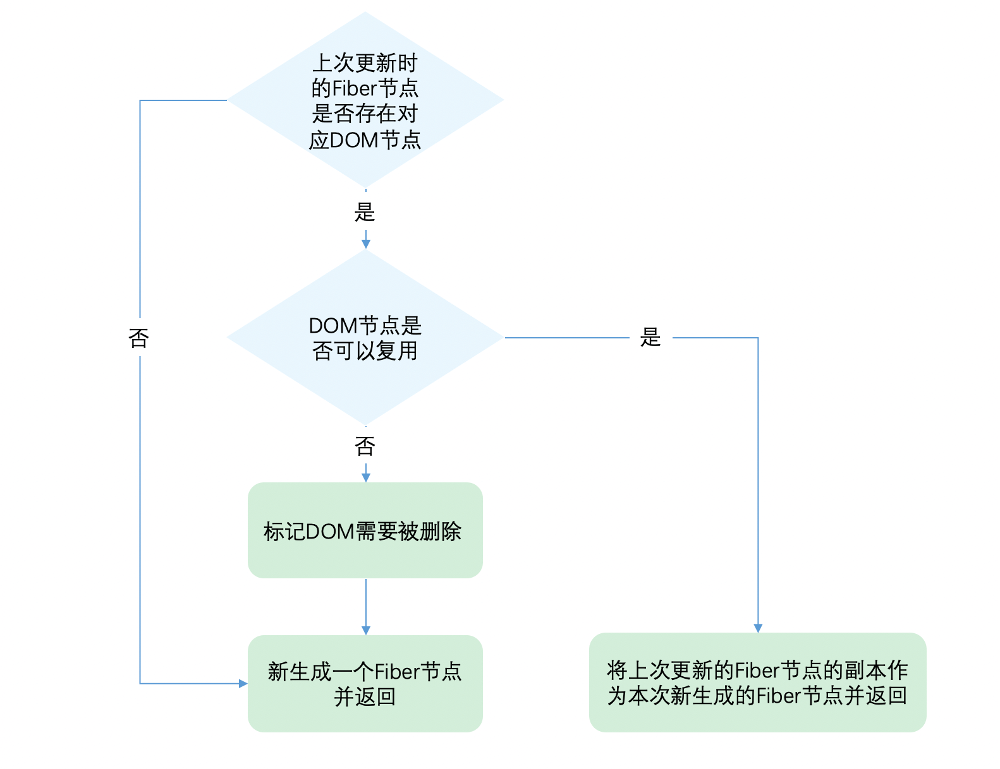

# diff 算法

    1.diff算法主要是基于层级比较
    2.如果节点类型相同，并且子节点有key，并且key相同，那么就认为是同一个节点，会复用这个节点；
    3.如果没有key的话，就会按照下标顺序比较；
        3.1.相同下标的情况下，节点类型不同，那么就会删除旧节点，插入新节点；
        3.2.如果节点类型相同，那么就会更新属性；
        3.3.如果新节点的数量大于旧节点的数量，那么就会插入新节点；
        3.4.如果新节点的数量小于旧节点的数量，那么就会删除旧节点；

## 如果是单节点的 diff 算法

    1.如果新旧节点的类型和key属性都相同，React会认为它们是同一个节点，并递归地比较它们的子节点。
    2.如果类型或key属性不同，React会认为它们是不同的节点，直接替换旧节点。

如上图所示：

## 如果是多节点的 diff 算法

1.通常多节点的 diff 都是有 key 的，因为 key 可以帮助 React 识别哪些节点是新增、删除、更新的。

    1.从newChildren和oldFiber的头部开始比较，如果类型和key相同，就复用这个节点，然后继续比较下一个节点。
        这轮遍历的节点都执行的更新操作；
    2.如果类型和key不同，就停止比较，进入第二次比较。
        2.1如果newChildren的节点和oldFiber的节点同时遍历完的话，最简单，就diff结束了；
        2.2如果newChildren的节点遍历完了，而oldFiber的节点还没有遍历完，那么就删除oldFiber剩余的节点；
        2.3如果oldFiber的节点遍历完了，而newChildren的节点还没有遍历完，那么就插入newChildren剩余的节点；
        除了2.1不进行操作，其他都执行的插入或者删除操作，
        这些情况都是比较简单的，逻辑简单的；
    3.如果newChildren和oldFiber的节点都没有遍历完，那么就进行移动比较；
        3.1我们将oldFiber的节点和key做一个映射，组成一个以为的映射关系；
            const map = new Map();
            map.set(oldFiber.key, oldFiber); // 粗略写法
        3.2map中找到的节点，就是复用的节点，插入；
            3.2.1我们每次记录下可复用节点的最后位置，如果下一个可复用节点的位置小于最后位置，那他就需要插入到后面，否则它本身就在后面，不需要移动；
            3.3.2如果出现一个节点，比最后位置还大，那就需要更新下最后位置；万一他俩中间还有需要往后移动的节点呢；
        3.3map中没有找到的节点，就是删除的节点，删除；
    4.以上内容说起来感觉说不请；有时间需要花个图；
