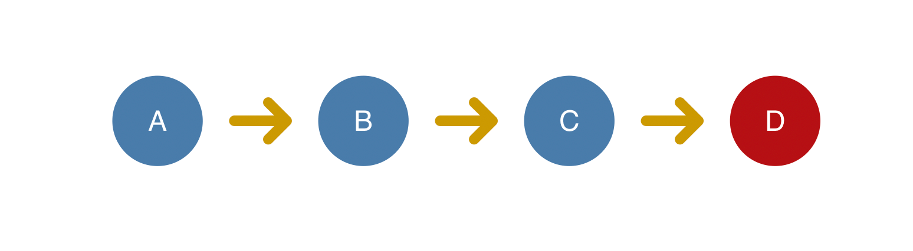
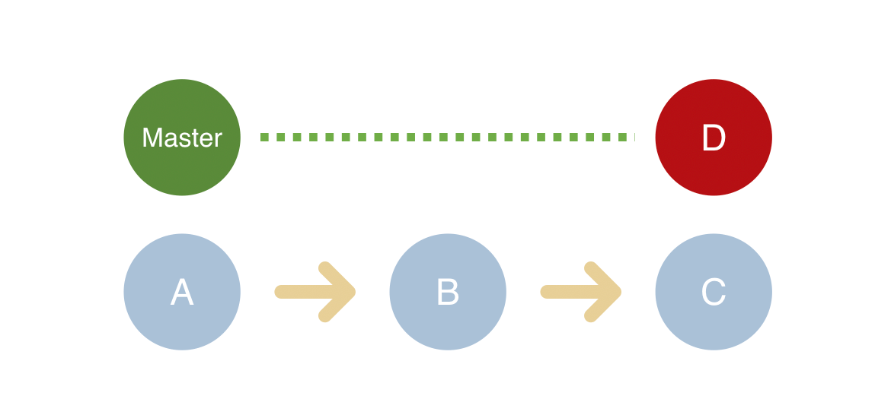
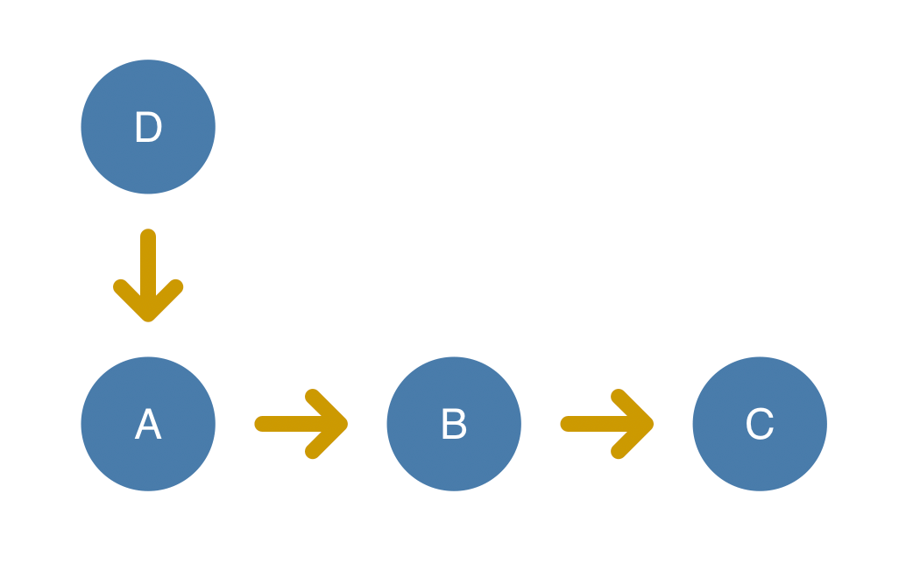

# 状态更新

## 触发更新整体流程

    1.在React中，触发更新的方式有4中；
        1.1 this.setState 触发更新；
        1.2 this.forceUpdate 来触发更新；
        1.3 useState 来触发更新；
        1.4 useReducer 来触发更新；
    2.创建Update对象；
    3.当某个组件触发更新时，这个组件会一直向上找到上级的`Fiber`节点，然后将这个`Fiber`节点标记为`更新`，一级一级网上，最终找到`Root Fiber`节点；返回rootFiber节点；
    4.通知调度器，有更新；
    5.调度器最终会在合适的时机，执行更新；进入render阶段；

## ~~这套并发模式的心智模型（目前我没有考虑并发，因为这个面试文档少）~~

    1.类似于git的版本控制，每个commit都是一个状态；
    2.在同步模式下，所有的更新都同步进行的；
    3.在并发模式下，会出现优先级的差异；
        3.1类似于git，我们也会把一些优先级高的任务提前合并；

## ClassComponent 与 HostRoot 共用的 Update

    1.Update存储了优先级，过期时间，回调函数等信息；
    2.一共三种组件（HostRoot | ClassComponent | FunctionComponent）可以触发更新。
    3.由于不同类型组件工作方式不同，所以存在两种不同结构的Update，
        3.1ClassComponent与HostRoot共用一套Update结构。
        3.2FunctionComponent单独使用一种Update结构。

## ClassComponent 与 HostRoot 共用 Update 的计算过程

    1.每个fiber节点都有一个updateQueue队列；有两个fiber节点，所以有两个updateQueue队列；
        1.current fiber节点的updateQueue队列；
        2.workinprocess fiber(alternate fiber)节点的updateQueue队列；

[UpdateQueue](./ReactUpdateQueue.ts#L160)的定义

以上代码是一个 updateQueue 队列的结构；

    1.baseState:表示当前的状态；Update基于该state计算更新后的state。
    2.firstBaseUpdate:表示第一个更新；这里是之前存储的低优先级的Update；
    3.lastBaseUpdate:表示最后一个更新；和上面一样；
        低优先级的更新就是高优先级的执行完，剩下没执行的；
    4.shared.pending:触发更新的时候，会创建一个update对象，然后将这个update对象放到这个队列中；
        这里存储的是本次新的更新；
    5.effects：数组。保存update.callback !== null的Update。
    6.最终会将shared.pending中的update和lastBaseUpdate连接起来组成一个数组；
        https://react.iamkasong.com/state/update.html#%E4%BE%8B%E5%AD%90
        这个文章的图就可以看出来。
    7.在合适的时机执行这个队列中的update；然后进入生成新的jsx，然后执行render的逻辑；

### 优先级

    我看过的面试题中没有看到过问这个的，所以先不写；
    https://react.iamkasong.com/state/priority.html#%E5%A6%82%E4%BD%95%E4%BF%9D%E8%AF%81%E7%8A%B6%E6%80%81%E6%AD%A3%E7%A1%AE
    有时间学习这个文章就行；
