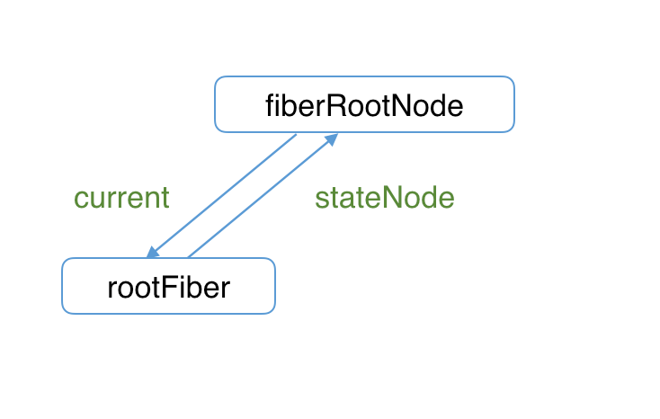

# ReactDom.render

## 还是这个例子

```jsx
const element = <h1 title="foo">Hello</h1>;
const container = document.getElementById("root");
ReactDOM.render(element, container);
```

1.我们给 ReactDom.render 传入了两个参数，一个是 React 元素，一个是容器；

## 流程


    1.我们先创建 fiberRootNode 是应用的根节点；然后创建一个 fiberRoot 对象，这个对象是 fiberRootNode 的 fiber 对象；然后就有了第一个 fiber 树的根节点；
    3.创建Update对象；
        3.1update.payload = {element: element}；这个代码的意思是update.payload是React元素，就是createElement返回的对象；
    4.然后调用scheduleUpdateOnFiber，这个函数的作用是将update对象放到fiberRoot.updateQueue中；
    5.然后根据调度器的调度，进入render阶段；
    6.进入render阶段，我们会创建一个workInProgressRoot，这个对象是fiberRoot的一个副本；
    7.然后进入commit阶段，我们会将workInProgressRoot的fiber对象的stateNode挂载到container上；
